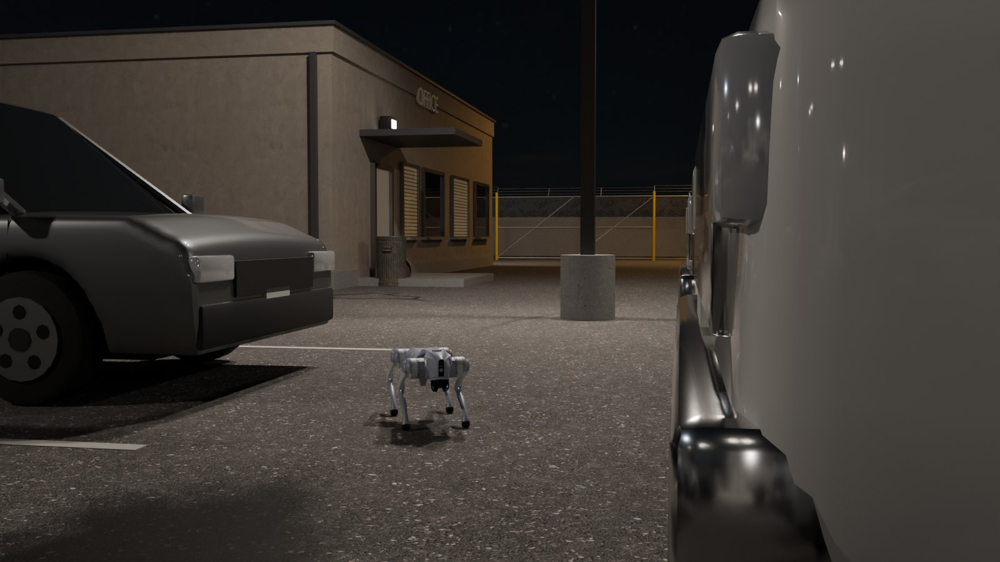
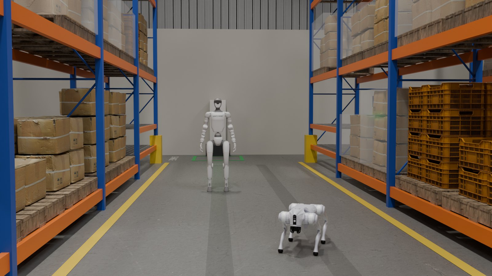
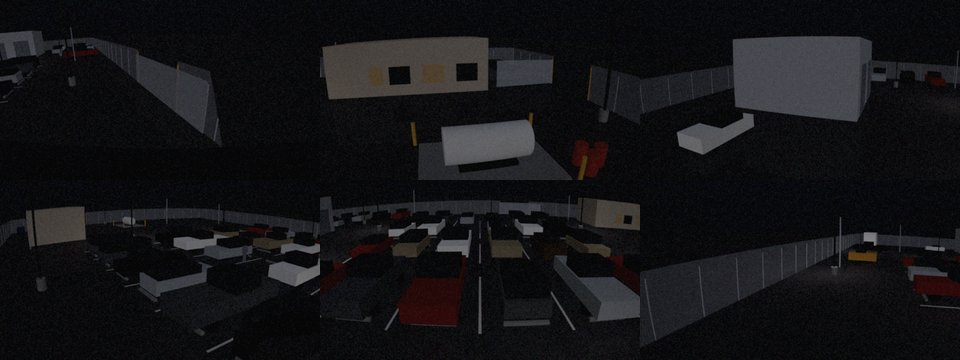
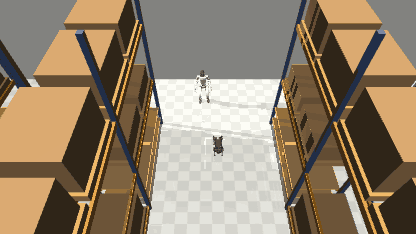

# dimos-worlds

Sim worlds for [DimOS](https://github.com/dimensionalOS/dimos), shipped as DimOS external blueprints.

- **Night vehicle lot.** Outdoor lot with six fixed CCTV cameras (distortion, noise, JPEG-style ISP), named places, and scripted events: person appears, gate opens, vehicle moves.
- **Warehouse.** 30 x 20 m building with pallet racking, pallets, conveyor and pick table, built from a layout file, with a known-occupancy prior map for DimOS's planner.
- **Shared-world fleet.** A Go2 and a G1 in one MuJoCo world, each on its own policy timestep, each with its own DimOS planner, and costmaps that show each robot the other.
- **Navigation-level coordination.** A DimOS module between goals and the planners: right of way from the planned paths, hold short of a shared stretch, yield to a pocket in head-on meetings, automatic retries, deadlock swap, and settling at the goal pose. No goal resends by hand.
- **Arm cell (optional).** A KUKA iiwa 14 on the warehouse pedestal, positional IK pick and place of a tote, as its own DimOS module.
- **Deterministic replay.** A command log plus periodic state hashes. A sim run re-executes bit-identically.





*Optional Blender path: the scenes rendered with Cycles, Menagerie Go2 and G1 placed by hand (stills, not frames of a run). `docs/media/render_heroes.py`.*



*The lot's six CCTV cameras at night, gate 2 open (MuJoCo render + `camera_model.isp`; boxes and flat lighting, not photoreal).*



*`warehouse-fleet`: G1 and Go2 each sent a goal over `*/goal_request`, each driven by its own `ReplanningAStarPlanner`. The GIF is that run's log re-executed and rendered (`docs/media/make_media.py`), sped up about 7x.*

## Why

- DimOS ships two scenes, `office` and `supermarket`. No outdoor, no night, no fixed cameras.
- DimOS multi-robot sim runs one MuJoCo sim per robot, so robots cannot see or collide with each other. Here they share one world.
- DimOS replay replays recorded sensor streams. It does not re-execute a sim run. This does, and checks it with state hashes.

## Status

Early. Targets `dimos==0.0.14`. A CI job tracks DimOS `main` and is allowed to fail. The G1 walks only (its arms do nothing); the only manipulation is the separate arm cell. See [Known limitations](#known-limitations).

## Install

Python 3.12. Not on PyPI yet; install from a checkout. System packages first:

- macOS: `brew install portaudio` (DimOS's Unitree extra builds `pyaudio`).
- Ubuntu/Debian: `sudo apt-get install portaudio19-dev libegl1 libgl1 git-lfs libusb-1.0-0` (PortAudio for `pyaudio`, EGL/GL for headless MuJoCo rendering, `git-lfs` for DimOS's first-use data download, libusb for DimOS's Go2 connection).

```
git clone <this repo> && cd dimos-worlds
uv venv --python 3.12 && source .venv/bin/activate
uv pip install -e ".[dev]"
```

On first use DimOS downloads its MuJoCo robot models and walking policies (`mujoco_sim` data) and MuJoCo Menagerie.

Headless Linux: `export MUJOCO_GL=egl` before `pytest` or `dimos run` (verified on Ubuntu 22.04 with an NVIDIA GPU; GitHub's Ubuntu runner uses Mesa's EGL).

## Run

Blueprints register under the `dimos.blueprints` entry-point group, so DimOS finds them by distribution name:

```
$ dimos list | grep dimos-worlds
  dimos-worlds.go2-lot-night
  dimos-worlds.go2-warehouse
  dimos-worlds.lot-cctv
  dimos-worlds.warehouse-arm
  dimos-worlds.warehouse-fleet
```

```
dimos --viewer none run dimos-worlds.go2-warehouse      # Go2 in the warehouse: DimOS's Go2 stack on the warehouse prior map
dimos --viewer none run dimos-worlds.warehouse-fleet    # Go2 + G1 in one shared world, one planner each, coordinated
dimos --viewer none run dimos-worlds.warehouse-arm      # the iiwa arm cell on its own (add it to warehouse-fleet the same way)
dimos --viewer none run dimos-worlds.go2-lot-night      # Go2 in the night lot: prior map, named places, events
dimos --viewer none run dimos-worlds.go2-lot-night dimos-worlds.lot-cctv   # ... plus the six CCTV cameras
```

Drop `--viewer none` for the Rerun viewer. The MuJoCo sims run headless; `DIMOS_WORLDS_VIEWER=1` opens MuJoCo's own viewer (needs a display). Run one DimOS instance at a time (`dimos status`, `dimos stop`).

Send a goal from another terminal:

```
dimos-worlds-goal /goal_request 12 11.4        # go2-warehouse
dimos-worlds-goal /goal_request -2 -17         # go2-lot-night (row D, south drive lane)

# warehouse-fleet: one goal topic per robot
dimos-worlds-goal /g1/goal_request 6 11
dimos-worlds-goal /go2/goal_request 12 11.4
```

`dimos-worlds-goal TOPIC X Y [--yaw RAD]` publishes a world-frame `PoseStamped` after waiting 3 s for peer discovery. `dimos topic send` (DimOS 0.0.14) publishes before discovery, so its goal is lost every time on Linux and sometimes on macOS. The planner logs `Got new goal` when a goal lands.

Watch odometry with `dimos topic echo /odom PoseStamped` (go2-warehouse, go2-lot-night), or `dimos topic echo /go2/odom PoseStamped` and `/g1/odom` (warehouse-fleet). In warehouse-fleet, `/go2/arrived` and `/g1/arrived` (Bool) say when a robot is at its goal, settled. Give the type name explicitly. A fresh `echo` can print nothing for 10-20 s while it discovers peers: echo longer.

Warehouse coordinates: metres, origin at the south-west inside corner, x east, y north. The cross aisle runs along y = 11.4. The Go2 starts at (3, 11.4), the G1 at (1, 11).

## Coordination

In `warehouse-fleet`, goals go to `FleetTraffic` (`dimos_worlds.coord`), not straight to the planners. It forwards each goal to that robot's planner (`{id}/nav_goal`), reads back the path the planner follows (`{id}/path`) and its result (`{id}/goal_reached`), and compares every pair of remaining paths. Two paths that come closer than the two bodies need to pass (radius + radius + 0.3 m), at a spot both robots reach within 8 m, are a conflict, and one robot gets the right of way:

1. A robot with no goal (parked, or settling) standing on an active robot's path moves to a pocket and comes back afterwards.
2. A robot already on the other's path, while the other is not on its path, goes first (a crossing, or a robot being followed). The other holds.
3. Both on each other's path (head-on in an aisle): the lower priority robot yields to a pocket, the nearest free spot off the winner's whole remaining path that it can reach without passing the winner. No pocket for it: the other yields.
4. Neither yet on the other's path: whoever reaches the shared spot first by more than 3 s goes, otherwise priority (list order in `robots.warehouse_fleet()`: Go2, then G1). The other holds.

A holding robot walks until it is 1 m short of the shared stretch and stands there (its planner gets its own pose as the goal) until the stretch moves on or clears. A yielding robot gets the pocket as its goal and its real goal back once the winner's path no longer comes near its own. A planner that gives up, or reports arrival away from the goal, gets the goal again after 3 s. If the robot with the right of way makes no progress for 25 s, the right of way is swapped. Every decision is logged (`traffic: ...`).

When the planner reports arrival, the G1 closes the last position and heading error itself (holonomic velocity commands, at most 0.15 m/s, to 0.12 m and 6 degrees); the Go2 corrects heading only (its small forward commands sit in the policy's dead band). Then `{id}/arrived` is published.

The rules (`coord/traffic.py`) are pure numpy, robot-agnostic, and know nothing about the warehouse: robots are ids with a radius, a priority and an optional settle config. `coord.module.traffic_coordinator(ids, name)` builds the DimOS module for any set of robot ids.

Scripted scenarios run the same stack in one process (the world, DimOS's own `GlobalPlanner` per robot, the robot-aware costmaps, the coordinator), each goal sent once:

```
python -m dimos_worlds.coord.scenarios head-on --runs 5    # aisle A-B, 2.5 m wide: Go2 and G1 start at opposite ends, each bound past the other
python -m dimos_worlds.coord.scenarios crossing --runs 5   # Go2 east along the cross aisle, G1 south down the 1.6 m east aisle across it
python -m dimos_worlds.coord.scenarios head-on --no-coord  # the same, planners only
```

Measured on macOS (Apple Silicon), real time, each goal sent once:

| scenario | coordinated | planners only |
|---|---|---|
| head-on | 5/5: Go2 arrives in 38-81 s, G1 in 104-147 s, both within 0.24 m and 9 degrees; G1 yields every run, one run needed the deadlock swap; closest 0.88 m between centres | 0/2: once the Go2's planner gave up and left it in the cross aisle; once both arrived but the bodies came within 0.63 m of each other (radii add up to 0.65) and the Go2 stood 173 degrees off its goal heading |
| crossing | 5/5: Go2 arrives in 22-25 s, G1 in 48-50 s, both within 0.09 m and 11 degrees; the G1 holds short of the crossing every run; closest 1.20 m | 0/2: the Go2's planner reports arrival without moving (see limitations) |

Live, with `dimos run dimos-worlds.warehouse-fleet` and each goal published once: Go2 and G1 sent to opposite ends of aisle A-B (head-on), the G1 yielded to a pocket in the east aisle, the Go2's planner gave up once next to it and got its goal again from the coordinator, both arrived (G1 0.05 m and 2 degrees off, Go2 0.09 m and 5 degrees), and `dimos-worlds-replay` matched all 54 state hashes of that run.

## Arm cell

`warehouse-arm` puts MuJoCo Menagerie's `kuka_iiwa_14` (fetched with DimOS's Menagerie copy, not vendored) on the pedestal by the conveyor, with a suction tool, and makes tote-09 at the conveyor's end a free body. Commands name two reach targets from `layout.json` (`conveyor`, `pick_table`, `pallet-2`):

```
dimos --viewer none run dimos-worlds.warehouse-arm
dimos-worlds-send /arm_command 'String("conveyor pick_table")'   # dimos topic send, after peer discovery
dimos topic echo /arm_status String     # above conveyor ... gripped; lifting ... released at pick_table ... done conveyor pick_table 26.617 11.993 0.813
```

The IK is positional (tool tip position, tool pointing straight down at a fixed heading, damped least squares from a few starts), the motion is minimum-jerk between IK solutions, tracked by the model's own joint servos with gravity compensation. It publishes `arm_joint_state` and `tote_pose`.

## Replay

`warehouse-fleet` writes `warehouse-fleet-run.jsonl` in the working directory: a header (scene sha256, robot specs, versions), every command with the tick it landed on, and a state hash every 250 ticks (5 s of sim time).

```
$ dimos-worlds-replay warehouse-fleet-run.jsonl
run: scene warehouse, robots go2, g1, 731 commands, 20 state hashes; recorded with {'mujoco': '3.15.0', 'platform': 'Linux-x86_64', 'dimos': '0.0.14', 'onnxruntime': '1.31.0', 'numpy': '2.5.3', 'dimos-worlds': '0.1.0'}
  tick 2540: g1 fell
  tick 2590: g1 recovered
  tick 3317: g1 fell
  tick 3367: g1 recovered
OK: 20 state hashes match; final state adee78f798939661 at tick 5000
```

A log only replays bit-exact on the stack it was recorded on. A macOS arm64 log replayed on Linux x86_64 (and the other way round) diverges at its first state hash, and replay says which recorded version or platform differs.

`python -m dimos_worlds.replay RUN.jsonl` does the same. Exit status is 0 when every hash matches and 1 at the first divergence. `--until TICK` stops early.

## Cook your own scene

Both worlds are generated, then cooked into a DimOS scene package: MJCF + `places.json` + `scene.meta.json`, the last written with DimOS's own `ScenePackage.write_metadata`.

```
python -m dimos_worlds.warehouse.gen_layout   # layout.json: building, racks, pallets, places, cameras
python -m dimos_worlds.warehouse.scene        # cooks warehouse/scene/ from layout.json
python -m dimos_worlds.lot.gen_lot            # cooks lot/scene/
```

To make your own: copy one of these packages, change the generator and cook it. Register a blueprint in your own `pyproject.toml` under `[project.entry-points."dimos.blueprints"]`, then `dimos run <your-dist>.<blueprint>`. `tests/test_warehouse.py` shows the checks a scene package should pass: DimOS loads it, it is static, and it composes with DimOS's Go1/G1 models.

Optional Blender renders (Blender 5.2, not a Python dependency):

```
python src/dimos_worlds/lot/assets/fetch.py         # Poly Haven (CC0) + Blender human base meshes, ~165 MB
python src/dimos_worlds/warehouse/assets/fetch.py   # Poly Haven + Menagerie G1, Go2, iiwa, ~100 MB
DIMOS_WORLDS_BLENDER=/path/to/blender python src/dimos_worlds/warehouse/render/render.py --out out/ --lights night,day
DIMOS_WORLDS_BLENDER=/path/to/blender python docs/media/render_heroes.py   # the README stills
```

Assets are fetched at build time into `*/assets/cache/`, never committed. `download.blender.org` refuses some cloud IPs (403); `fetch.py` then names the file to download by hand.

## Known limitations

- **Verified on macOS (Apple Silicon) and Ubuntu 22.04 x86_64 (RTX 3090, EGL).** On Linux: the test suite, the opt-in lot e2e, all five blueprints under `dimos --viewer none run` (goals sent and arrival checked on odometry; warehouse-arm's conveyor-to-pick-table move), replay of a Linux-recorded run, and the Blender render path. The coordinated head-on test (`test_coord_fleet.py`) failed once in three Linux runs; both robots arrived in the failing run too. CI runs the tests on GitHub's Ubuntu and macOS runners. Not tried: Linux arm64, Windows, Linux without a GPU outside CI.
- **Blender path: stills only.** The builders, `warehouse/render/render.py`, the lot's `render/render_frames.py` and `docs/media/render_heroes.py` ran (Blender 5.2.2, Cycles/OptiX). Robots in those renders are placed, not driven by a sim run; `build_scene.py --state` (posing a recorded moment) has not been run.
- **Bit-exact replay needs the same stack.** Replay needs the MuJoCo, ONNX Runtime, numpy and OS/CPU architecture the run was recorded on (the log header records them). macOS arm64 and Linux x86_64 logs do not replay on each other. A changed scene file is refused.
- **G1 arrival times are chaotic across platforms.** Same commands, different float rounding: on Linux x86_64 the G1 overshoots a route corner and turns in place where macOS arm64 does not, and arrives about 8 s later (25 s vs 17 s in the fleet test). It still arrives. Each platform is deterministic with itself. In one coordinated warehouse-fleet run on Linux the G1 fell twice (recovered, arrived); replay reproduces the falls.
- **Policy dead bands are compensated, not fixed.** DimOS's Go1/Go2 walking policy barely turns in place below about 0.8 rad/s and does not walk forward below about 0.3. The G1 policy walks about 1.45x the command, under-turns while walking and creeps when standing. The compensation is explicit per-robot config (`robots.Compensation`, recorded in every run log header): Go2 in-place turns from `cmd_vel` are raised to 0.8 rad/s and the route controller has its own floors; the G1's `cmd_vel` is tracked as a velocity (feed-forward + PI on measured velocity) and it holds its pose at zero command. `WarehouseFleetSimConfig.compensate=False` turns it all off. go2-warehouse (DimOS's own Go2 sim connection) raises slow in-place turns the same way. All numbers were measured in this sim, not on hardware.
- **Coordination is proven for two robots.** The rules are written for any number of robots and the module takes any ids, but only Go2 + G1 have been run. With three or more, pairwise decisions can form a cycle; the deadlock swap is the only guard and has not been exercised that way.
- **Coordination is conservative.** Any two paths that come within passing distance count as a conflict, even in a 3.3 m aisle where the planners could squeeze past each other, so one robot waits. There are no timed reservations: the decision uses where the paths go and estimated arrival, not a schedule.
- **A pocket needs free floor.** A 2.5 m aisle is too narrow to step aside in (bodies plus margins need about 2.7 m), so a yielding robot backs out of the aisle. A dead-end with no pocket falls back to holding and the deadlock swap.
- **DimOS's planner sometimes reports arrival without moving.** When a robot already faces along its new path, `ReplanningAStarPlanner` (dimos 0.0.14) can go straight to its final rotation and report the goal reached at the start. The coordinator sees the robot is not at the goal and sends the goal again 3 s later; without the coordinator the robot just stays.
- **Slow corners look "stuck" to DimOS.** Its sim stuck check (under 1 m in 8 s) fires repeatedly while the Go2 turns around rack ends. The planner replans each time and still arrives: 2 min 10 s from (3, 11.4) to (15, 7.5) in one verified run.
- **Go2 goal pose is the planner's.** The Go2 settles its heading only (11 degrees off at worst in the runs above); its position is where DimOS's planner stops it, up to about 0.25 m off.
- **The arm cell is a separate simulation.** It has its own MuJoCo model and thread: the walking robots do not see it move (they keep out of its stay-out anyway), and arm runs are not in the shared world's run log or replay. The suction grip is kinematic (the gripped tote follows the tool). One tote is free; the others stay static scenery.
- **MuJoCo visuals are boxes with flat lighting.** Fine for pipelines and change detection, not for judging what a real night camera sees.
- **Lot CCTV frames are rendered, not recorded.** Camera model parameters are typical datasheet values, UNVERIFIED against any specific camera.

## Credits

DimOS (Dimensional Inc., Apache-2.0), MuJoCo Menagerie Unitree and Drake models (BSD-3-Clause), Poly Haven assets (CC0). Full list in [NOTICE](NOTICE).

## License

Apache-2.0. See [LICENSE](LICENSE).

Built by Isaiah Bjorklund.
